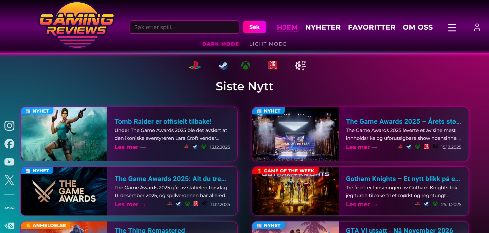
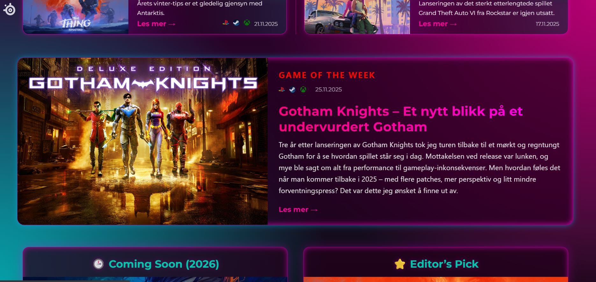
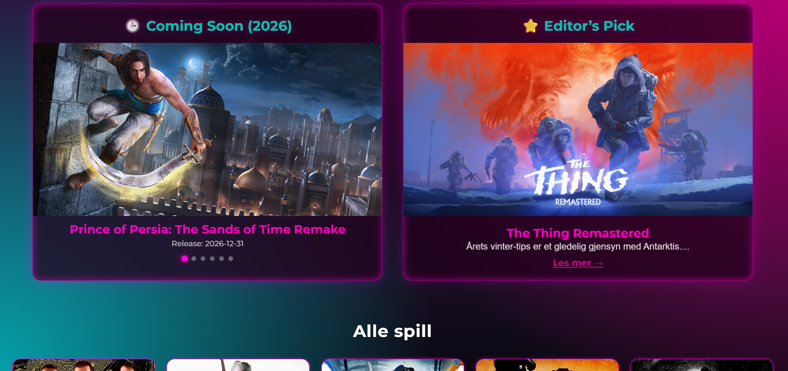
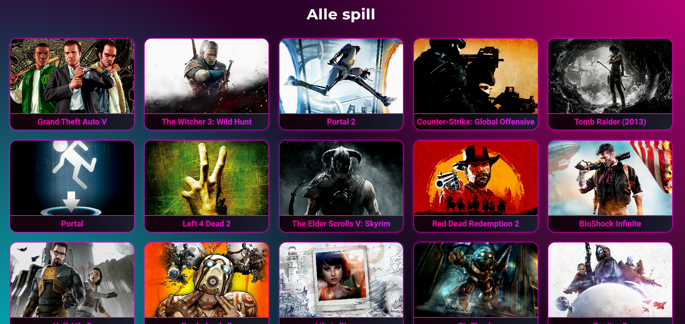
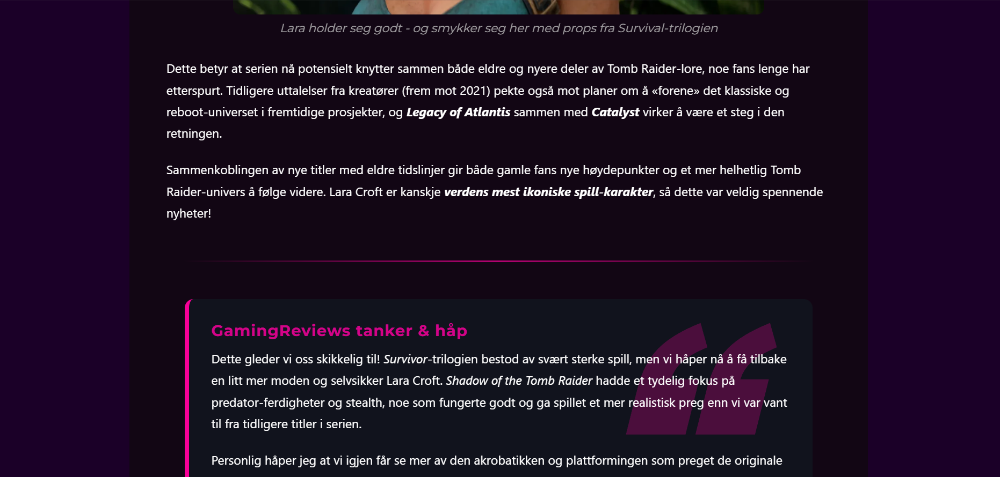
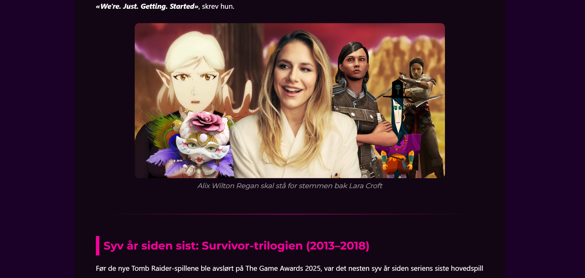
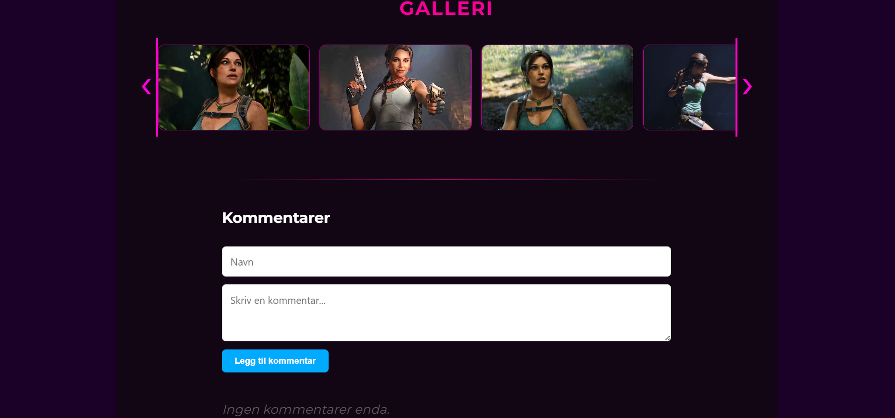
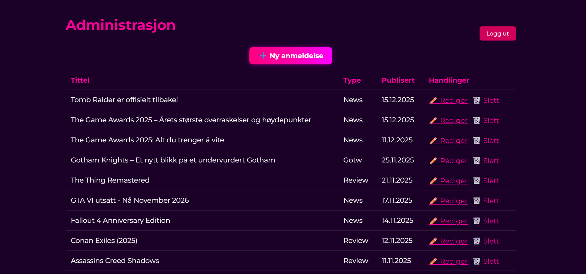

# 🎮 GameReviews – Fullstack spillanmeldelser

GameReviews er en fullstack webapplikasjon for spillanmeldelser og nyheter.  
Prosjektet er bygget som en moderne SPA med React i frontend og Node.js + MongoDB i backend.

Målet med prosjektet har vært å bygge en realistisk, produksjonsnær løsning som kombinerer:

- API-integrasjoner
- dynamisk innhold
- admin-funksjonalitet
- moderne UI/UX

Dette prosjektet brukes som del av min personlige portefølje.

---

## Funksjoner

### Innhold

- Spillanmeldelser, nyhetssaker og _Game of the Week_
- Markdown-støtte for rikt innhold (bilder, video, seksjoner)
- Editor’s Pick-markering
- Publiseringsdato og plattformer

### Kommentarer

- Brukere kan legge igjen kommentarer på anmeldelser og nyheter
- Tidsvisning (“for 5 minutter siden”)
- Admin-kommentarer merkes tydelig
- Admin kan slette kommentarer

### Media & presentasjon

- Bildegalleri med modal-visning
- Keyboard-navigasjon (← → Esc)
- Platform-ikoner (PlayStation, PC, Xbox, Nintendo)
- Responsive layouts

### Spilldata

- Integrasjon mot RAWG API for spilloversikt
- Søk og paginering
- “Coming Soon”-seksjon med automatisk rotasjon

---

## Tech Stack

### Frontend

- **React** (Vite)
- React Router
- Axios
- CSS (custom styling)
- React Markdown (remark + rehype)

### Backend

- **Node.js**
- **Express**
- **MongoDB** + Mongoose
- REST API

### Deployment

- Frontend: GitHub Pages
- Backend: Render
- Database: MongoDB Atlas

---

## Fokus i prosjektet

Dette prosjektet er laget med fokus på:

- Strukturert komponent-arkitektur
- Tydelig skille mellom frontend og backend
- Reell dataflyt (API → DB → UI)
- Praktisk bruk av React hooks
- Feilhåndtering og edge cases
- Vedlikeholdbar kode fremfor raske hacks

---

## Screenshots

### Forside

### Anmeldelse

### Kommentarer

### Admin

### Demo/GIF

---

## Videre arbeid (planlagt)

- Ekte autentisering (JWT / sessions)
- Backend-basert admin-autorisasjon
- Forbedret kommentarsystem
- UI-polish og animasjoner
- Testing (frontend / backend)

---

## Om meg

Jeg er en frontend-utvikler under opplæring med sterkt fokus på React og moderne webutvikling.  
Dette prosjektet representerer hvordan jeg jobber strukturert med både design, logikk og arkitektur.

Prosjektet vises frem i jobbsøking og tekniske samtaler.
